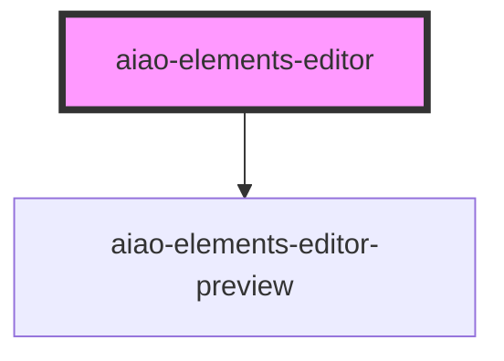

# aiao-elements-editor

<!-- Auto Generated Below -->

## Properties

| Property   | Attribute   | Description   | Type                                              | Default     |
| ---------- | ----------- | ------------- | ------------------------------------------------- | ----------- |
| `config`   | --          | elements 配置   | `IElementConfig[]`                                | `undefined` |
| `disabled` | `disabled`  |               | `boolean`                                         | `undefined` |
| `editMode` | `edit-mode` | elements 编辑模式 | `"add" \| "edit" \| "move" \| "resize" \| "view"` | `'edit'`    |
| `name`     | `name`      |               | `string`                                          | `undefined` |
| `value`    | --          | elements 数据   | `IElementData[]`                                  | `undefined` |
| `view`     | --          | 视图元素          | `HTMLElement`                                     | `undefined` |

## Dependencies

### Depends on

- [aiao-elements-editor-preview](../elements-preview)

### Graph

----------------------------------------------

*Built with [StencilJS](https://stenciljs.com/)*
