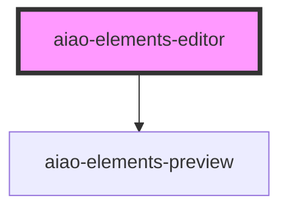

# aiao-elements-editor

elemens 编辑器

<!-- Auto Generated Below -->

## Properties

| Property   | Attribute   | Description | Type                                              | Default     |
| ---------- | ----------- | ----------- | ------------------------------------------------- | ----------- |
| `config`   | --          | 配置        | `IElementConfig[]`                                | `undefined` |
| `disabled` | `disabled`  | 禁用        | `boolean`                                         | `undefined` |
| `editMode` | `edit-mode` | 编辑模式    | `"add" or "edit" or "move" or "resize" or "view"` | `'edit'`    |
| `name`     | `name`      | form 名     | `string`                                          | `undefined` |
| `value`    | --          | 值          | `IElementData[]`                                  | `undefined` |
| `view`     | --          | 显示视图    | `HTMLElement`                                     | `undefined` |

## Dependencies

### Depends on

- [aiao-elements-preview](../elements-preview)

### Graph

---

_Built with [StencilJS](https://stenciljs.com/)_
