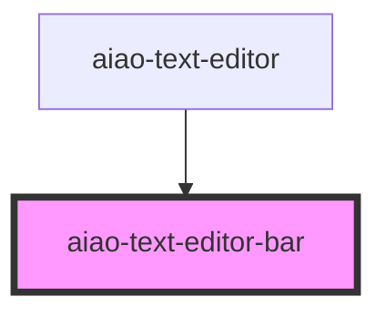

# aiao-text-editor-bar

<!-- Auto Generated Below -->

## Properties

| Property      | Attribute | Description | Type                     | Default     |
| ------------- | --------- | ----------- | ------------------------ | ----------- |
| `actionState` | --        |             | `TextActionState`        | `undefined` |
| `options`     | --        |             | `TextEditorBarOptions[]` | `undefined` |

## Events

| Event    | Description | Type               |
| -------- | ----------- | ------------------ |
| `action` |             | `CustomEvent<any>` |

## Dependencies

### Used by

- [aiao-text-editor](../text-editor)

### Graph

---

_Built with [StencilJS](https://stenciljs.com/)_
