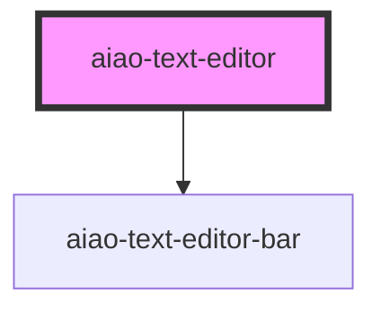

# aiao-text-editor

富文本编辑器

<!-- Auto Generated Below -->

## Properties

| Property                    | Attribute                     | Description      | Type          | Default     |
| --------------------------- | ----------------------------- | ---------------- | ------------- | ----------- |
| `defaultParagraphSeparator` | `default-paragraph-separator` | 段落符           | `string`      | `'p'`       |
| `disabled`                  | `disabled`                    | 禁用             | `boolean`     | `false`     |
| `element`                   | --                            |  绑定的 dom 元素 | `HTMLElement` | `undefined` |
| `name`                      | `name`                        | form name        | `string`      | `undefined` |
| `showActionBar`             | `show-action-bar`             | 显示命令条       | `boolean`     | `true`      |
| `value`                     | `value`                       | form value       | `string`      | `''`        |

## Events

| Event             | Description | Type                                  |
| ----------------- | ----------- | ------------------------------------- |
| `aiaoChange`      | 值改变      | `CustomEvent<InputChangeEventDetail>` |
| `aiaoStateChange` |             | `CustomEvent<TextActionState>`        |

## Methods

### `action(action: TA, value?: any) => Promise<void>`

执行命令

#### Returns

Type: `Promise<void>`

### `getSelectionElements() => Promise<HTMLElement[]>`

得到选中的标签

#### Returns

Type: `Promise<HTMLElement[]>`

### `restoreSelection() => Promise<void>`

恢复选择位置

#### Returns

Type: `Promise<void>`

### `saveSelection() => Promise<void>`

记录选择位置

#### Returns

Type: `Promise<void>`

## Dependencies

### Depends on

- [aiao-text-editor-bar](../text-editor-bar)

### Graph

---

_Built with [StencilJS](https://stenciljs.com/)_
