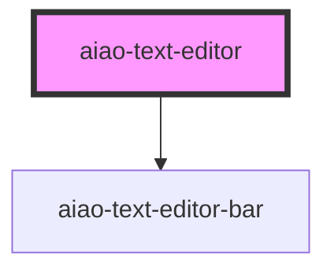

# aiao-text-editor

<!-- Auto Generated Below -->

## Properties

| Property                    | Attribute                     | Description | Type          | Default     |
| --------------------------- | ----------------------------- | ----------- | ------------- | ----------- |
| `actionBar`                 | `action-bar`                  |             | `boolean`     | `true`      |
| `defaultParagraphSeparator` | `default-paragraph-separator` | 段落符      | `string`      | `undefined` |
| `disabled`                  | `disabled`                    |             | `boolean`     | `false`     |
| `element`                   | --                            |             | `HTMLElement` | `undefined` |
| `name`                      | `name`                        |             | `string`      | `undefined` |
| `value`                     | `value`                       | 编辑模式    | `string`      | `''`        |

## Events

| Event             | Description | Type                                  |
| ----------------- | ----------- | ------------------------------------- |
| `aiaoChange`      | 值改变      | `CustomEvent<InputChangeEventDetail>` |
| `aiaoStateChange` |             | `CustomEvent<TextActionState>`        |

## Methods

### `action(action: TA, value?: any) => Promise<void>`

#### Returns

Type: `Promise<void>`

### `getSelectionElements() => Promise<HTMLElement[]>`

得到选中的标签

#### Returns

Type: `Promise<HTMLElement[]>`

### `restoreSelection() => Promise<void>`

恢复选择位置

#### Returns

Type: `Promise<void>`

### `saveSelection() => Promise<void>`

记录选择位置

#### Returns

Type: `Promise<void>`

## Dependencies

### Depends on

- [aiao-text-editor-bar](../text-editor-bar)

### Graph

---

_Built with [StencilJS](https://stenciljs.com/)_
