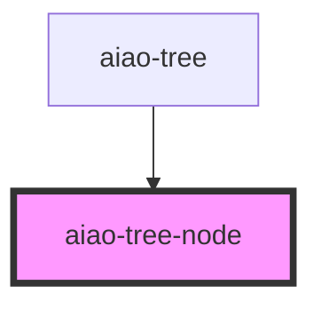

# aiao-tree-node

tree 节点

<!-- Auto Generated Below -->

## Properties

| Property     | Attribute    | Description    | Type                               | Default     |
| ------------ | ------------ | -------------- | ---------------------------------- | ----------- |
| `canDrag`    | `can-drag`   | 可拖放         | `boolean`                          | `false`     |
| `checkable`  | `checkable`  | 是否可检查     | `boolean`                          | `false`     |
| `disabled`   | `disabled`   | 是否禁用       | `boolean`                          | `false`     |
| `expanded`   | `expanded`   | 是否展开       | `boolean`                          | `false`     |
| `icon`       | --           | 图标名         | `{ name?: string; src?: string; }` | `undefined` |
| `isLeaf`     | `is-leaf`    | 是否是叶子节点 | `boolean`                          | `false`     |
| `name`       | `name`       | 标题           | `string`                           | `undefined` |
| `selectable` | `selectable` | 可选模式       | `boolean`                          | `false`     |
| `selected`   | `selected`   |                | `boolean`                          | `false`     |
| `showIcon`   | `show-icon`  | 显示图标       | `boolean`                          | `false`     |
| `showLine`   | `show-line`  | 显示线         | `boolean`                          | `false`     |
| `value`      | `value`      | 唯一值         | `number or string`                 | `undefined` |

## Events

| Event                   | Description | Type                         |
| ----------------------- | ----------- | ---------------------------- |
| `aiaoTreeNodeClick`     | click       | `CustomEvent<TreeNodeEvent>` |
| `aiaoTreeNodeDragEnd`   | drag end    | `CustomEvent<TreeNodeEvent>` |
| `aiaoTreeNodeDragEnter` | drag enter  | `CustomEvent<TreeNodeEvent>` |
| `aiaoTreeNodeDragLeave` | drag leave  | `CustomEvent<TreeNodeEvent>` |
| `aiaoTreeNodeDragOver`  | drag over   | `CustomEvent<TreeNodeEvent>` |
| `aiaoTreeNodeDragStart` | drag start  | `CustomEvent<TreeNodeEvent>` |
| `aiaoTreeNodeDrop`      | drop        | `CustomEvent<TreeNodeEvent>` |
| `aiaoTreeNodeOut`       | out         | `CustomEvent<TreeNodeEvent>` |
| `aiaoTreeNodeOver`      | over        | `CustomEvent<TreeNodeEvent>` |

## Dependencies

### Used by

- [aiao-tree](../tree)

### Graph

---

_Built with [StencilJS](https://stenciljs.com/)_
