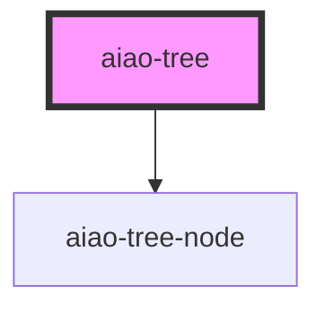

# aiao-tree

<!-- Auto Generated Below -->

## Properties

| Property              | Attribute               | Description       | Type               | Default     |
| --------------------- | ----------------------- | ----------------- | ------------------ | ----------- |
| `autoExpandParent`    | `auto-expand-parent`    | 是否自动展开父级  | `boolean`          | `false`     |
| `canDrag`             | `can-drag`              | 可拖动            | `boolean`          | `true`      |
| `checkable`           | `checkable`             | 是否可检查        | `boolean`          | `false`     |
| `config`              | --                      | 节点配置          | `TreeNodeConfig[]` | `undefined` |
| `data`                | --                      | 节点数据          | `TreeNodeData[]`   | `undefined` |
| `defaultExpandLevel`  | `default-expand-level`  | 默认展开级别      | `number`           | `1`         |
| `defaultExpandParent` | `default-expand-parent` | 默认展开父级      | `boolean`          | `true`      |
| `defaultExpandedKeys` | --                      | 默认展开的 key 表 | `string[]`         | `[]`        |
| `defaultSelectedKeys` | --                      | 默认选中的 key 表 | `string[]`         | `[]`        |
| `disabled`            | `disabled`              | 是否禁用          | `boolean`          | `false`     |
| `multiple`            | `multiple`              | 是否多选          | `boolean`          | `false`     |
| `selectable`          | `selectable`            | 可选模式          | `boolean`          | `true`      |
| `showIcon`            | `show-icon`             | 显示图标          | `boolean`          | `true`      |
| `showLine`            | `show-line`             | 显示线            | `boolean`          | `false`     |
| `showMode`            | `show-mode`             | 显示模式          | `"list" or "tree"` | `'tree'`    |

## Events

| Event                | Description    | Type                          |
| -------------------- | -------------- | ----------------------------- |
| `aiaoChange`         | change         | `CustomEvent<void>`           |
| `aiaoTreeDrop`       | tree drop      | `CustomEvent<any>`            |
| `aiaoTreeNodeChange` | 改变的数据节点 | `CustomEvent<TreeNodeData[]>` |

## Methods

### `canDrop(dragNodeData: TreeNodeData, dropNode: TreeNode) => Promise<boolean>`

是否可以拖进来

#### Returns

Type: `Promise<boolean>`

### `nodeRefMap() => Promise<Map<string, HTMLAiaoTreeNodeElement>>`

获取实体 map

#### Returns

Type: `Promise<Map<string, HTMLAiaoTreeNodeElement>>`

### `outElement(elementId: string) => Promise<void>`

#### Returns

Type: `Promise<void>`

### `overElement(elementId: string) => Promise<void>`

#### Returns

Type: `Promise<void>`

### `select(id: string) => Promise<void>`

#### Returns

Type: `Promise<void>`

## Dependencies

### Depends on

- [aiao-tree-node](../tree-node)

### Graph

---

_Built with [StencilJS](https://stenciljs.com/)_
